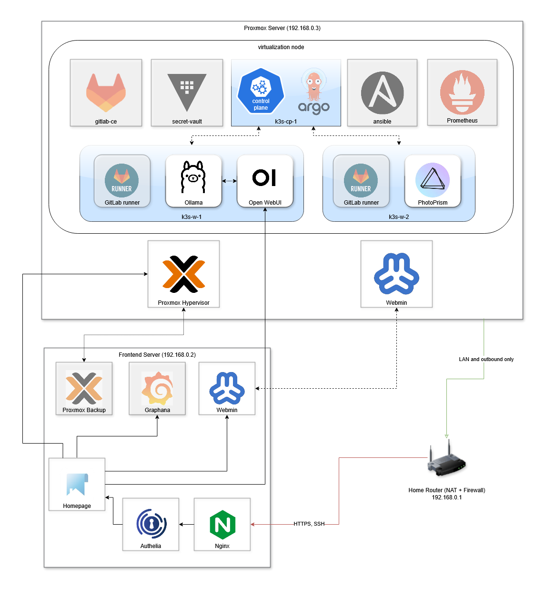
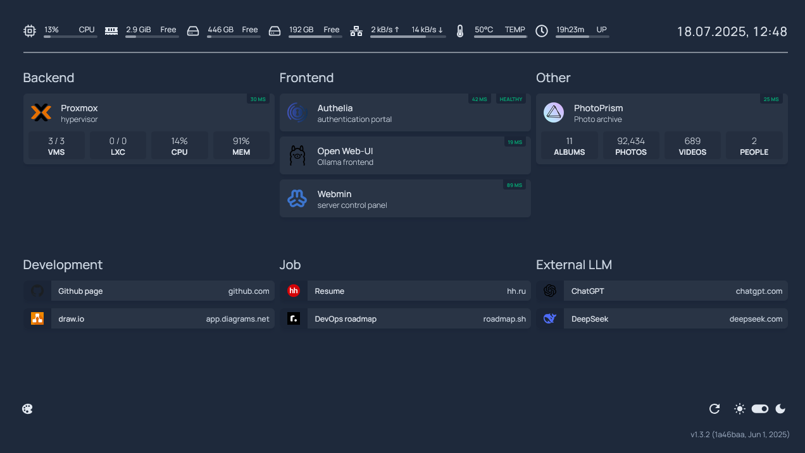
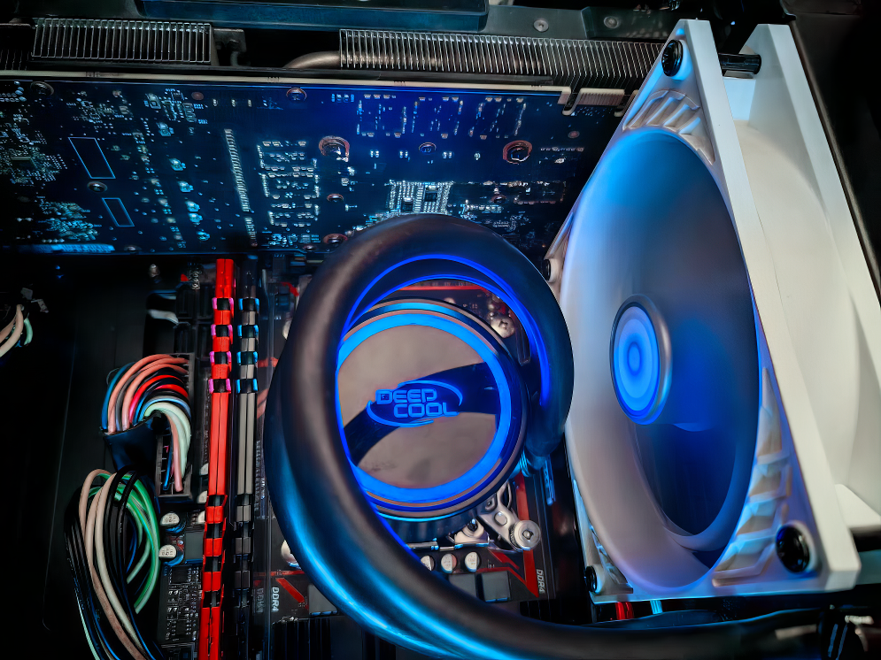
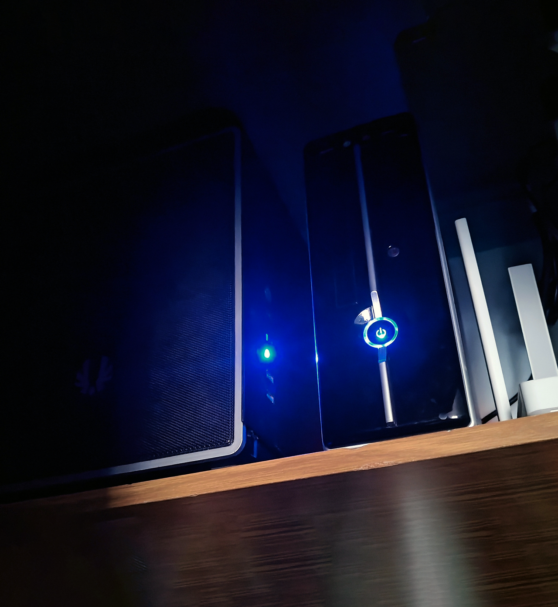

# 🏡 Homelab: Proxmox + K3s + LLMs

## Quick Overview
- Proxmox VE hypervisor, K3s Kubernetes cluster
- GPU passthrough for LLM workloads (Ollama, OpenWebUI)
- PhotoPrism for photo management (on storage node)
- Secure access: Nginx + Authelia (2FA)

---

## 📚 Documentation
- [Authelia Config & User Management](./docker/authelia/README.md)
- [Certbot Renewal Status](./docs/certbot-renewal-status.md)
- [Cluster Topology & Rationale](./docs/cluster-topology.md)
- [Deployment Reference Guides](./docs/references.md)
- [Homepage Config & Customization](./docker/homepage/README.md)
- [Kubernetes Infrastructure](./k8s/README.md)
- [Known Limitations](./docs/limitations.md)
- [Legacy Networking (NAT & Port Forwarding)](./docs/legacy-networking.md)
- [LLM Stack Details](./docs/llm-stack.md)
- [Planned CI/CD Stack & Services](./docs/ci-cd.md)
- [Planned Services Integration Sequence](./docs/planned-services-integration.md)
- [Roadmap & To-Do](./docs/roadmap.md)
- [Secrets Management](./secrets/README.md)
- [Virtualization Environment](./docs/virtualization.md)

---

## 🚀 Services Summary
| Service         | Node/Location   | Purpose                        |
|-----------------|-----------------|--------------------------------|
| Nginx           | Frontend server | Reverse proxy/HTTPS            |
| Authelia        | Frontend server | Authentication/2FA             |
| Webmin          | Frontend server, backend server | System admin panel        |
| Homepage        | Frontend server | Central dashboard              |
| Ollama          | k3s-w-1         | Local LLM server               |
| OpenWebUI       | k3s-w-1         | LLM chat frontend              |
| PhotoPrism      | k3s-w-2         | Photo management               |
| *GitLab CE* (planned)       | VM              | Git hosting/CI                 |
| *GitLab Runner* (planned)   | k3s-w-1, k3s-w-2| CI/CD pipelines                |
| *Secret Vault* (planned)    | VM              | Secrets management             |
| *ArgoCD* (planned)          | k3s-cp-1        | GitOps CD for K8s              |
| *Ansible* (planned)         | VM              | Automation/orchestration       |
| *Prometheus* (planned)      | VM              | Monitoring/metrics             |
| *Grafana* (planned)        | Frontend server | Dashboards/visualization       |
| *Proxmox Backup* (planned) | Frontend server | VM backup management           |

---

## 🖥️ Cluster Diagram

Show Diagram

*Diagram: Homelab infrastructure overview. Dimmed blocks represent planned (not yet implemented) services. Shows Proxmox virtualization, Kubernetes nodes, core services (LLM, PhotoPrism, CI/CD), frontend dashboard, and secure network flow.*

---

## 🔐 Security & Access
- Nginx reverse proxy with HTTPS
- Authelia for 2FA and authentication
- All sensitive services gated behind Authelia

---

## 🗂️ Homepage Dashboard

- Central dashboard with links to: OpenWebUI, Grafana, GitLab, ArgoCD, Webmin, PhotoPrism, Proxmox, Authelia, Proxmox Backup
- Service status and container health
- Auth via Authelia + Nginx

---

Hardware Overview

| Component       | Specification                                 |
|----------------|------------------------------------------------|
| **CPU**         | Intel Xeon E5-2673 v4 (20c/40t)               |
| **Motherboard** | X99K (Socket 2011-3)                          |
| **RAM**         | 64GB DDR4 ECC (4×16GB)                        |
| **GPU**         | Nvidia EVGA P104-100 (8GB VRAM, unlocked)     |
| **Storage**     | 1TB Crucial P2 NVMe SSD                       |
| **NIC**         | 1 Gb/s Ethernet adapter                       |

*Main server interior.*

*Homelab servers in operation.*

Virtual Machines

| VM Name     | Purpose               | Notes |
|-------------|-----------------------|-------|
| `k3s-cp-1`  | K3s Control Plane     | Hosts core Kubernetes services |
| `k3s-w-1`   | K3s Worker Node       | GPU-enabled node for LLM workloads |
| `k3s-w-2`   | K3s Worker Node       | PhotoPrism deployment (storage-focused) |
| `gitlab-ce` | Planned GitLab Server | 4–8 vCPU, 8–16GB RAM, 100GB+ disk |

Networking

- Bridged Ethernet for direct VM/K8s service IPs
- HTTPS via Nginx reverse proxy
- NAT for outbound traffic (via home router)
- [Legacy NAT/iptables workaround](./docs/legacy-networking.md) for Wi-Fi-only setups

LLM Stack & Observability

- **Ollama**: Local LLM server (LLaMA, Mistral, etc.)
- **OpenWebUI**: Web chat interface for Ollama
- **NVIDIA GPU Operator**: Automatic GPU provisioning in K8s
- **PhotoPrism**: Private photo management/search
- **Prometheus & Grafana**: Monitoring (planned)
- **Webmin**: System admin panel

Secrets Management

- HashiCorp Vault for centralized secrets
- External Secrets Operator for K8s secret injection
- SOPS template for encrypted K8s secrets

Known Limitations

- GPU (EVGA P104-100) requires BIOS flash for full VRAM
- NVMe may throttle under sustained load

Reference Guides

- [K3s Docs](https://docs.k3s.io/installation/)
- [Proxmox PCI(e) Passthrough](https://pve.proxmox.com/wiki/Pci_passthrough)
- [NVIDIA GPU Operator Docs](https://docs.nvidia.com/datacenter/cloud-native/gpu-operator/)
- [OpenWebUI GitHub](https://github.com/open-webui/open-webui)
- [Ollama GitHub](https://github.com/ollama/ollama)

