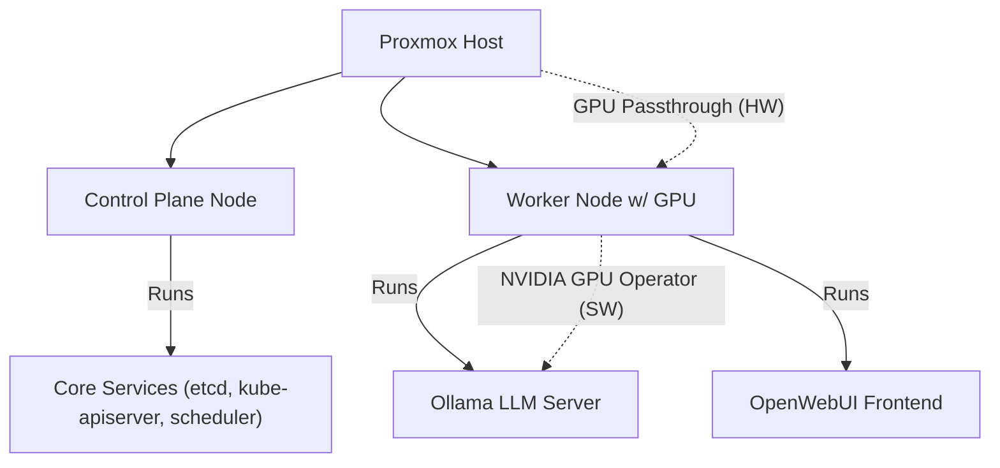

# 🏡 HomeLab Setup: K3s + Ollama + OpenWebUI on Proxmox

This project describes a lightweight, GPU-accelerated home lab deployment using [K3s](https://k3s.io/), [Ollama](https://ollama.com/), and [OpenWebUI](https://github.com/open-webui/open-webui). The system is optimized for for running local large language models (LLMs) with GPU passthrough on a Proxmox-hosted Kubernetes cluster.

---

## 🕒 Planned (Not Yet Implemented) Services

The following services are shown as dimmed blocks in the diagram above and are planned for future implementation. All planned services mentioned elsewhere in this document are consolidated here for clarity:

- **Ansible** – Automation and orchestration tool for infrastructure management
- **Grafana** – Visualization and dashboarding for monitoring data
- **Prometheus** – Metrics collection and monitoring
- **GitLab CE** – Self-hosted Git platform for code and CI/CD
- **GitLab Runner** – Executes CI/CD pipelines for GitLab
- **ArgoCD** – Declarative GitOps delivery and continuous deployment for Kubernetes
- **Secret Vault** – Centralized secrets management (e.g., HashiCorp Vault)

---

## 📦 Hardware Overview

| Component       | Specification                                 |
|----------------|------------------------------------------------|
| **CPU**         | Intel Xeon E5-2673 v4 (20 cores / 40 threads) |
| **Motherboard** | X99K (Socket 2011-3)                          |
| **RAM**         | 64GB DDR4 ECC (4×16GB)                        |
| **GPU**         | Nvidia EVGA P104-100 (8GB VRAM, unlocked)     |
| **Storage**     | 1TB Crucial P2 NVMe SSD                       |
| **NIC**         | 1 Gb/s Ethernet adapter                       |

---

## 🖥️ Virtualization Environment

- **Hypervisor**: Proxmox VE
- **Virtualization Type**: KVM/QEMU
- **GPU Passthrough**: Enabled (via `vfio` + NVIDIA GPU Operator in K3s)
- **Networking**:
  - **LAN** (bridged) for internal traffic and overlay networks
  - **NAT** via home router for outbound/internet traffic
  - **HTTPS exposed** via reverse proxy

---

## 📈 Cluster Topology

> Diagram: Simple two-node K3s cluster running Ollama and OpenWebUI on GPU-enabled worker.

---

## 🧠 LLM Stack

- **Ollama** – serves locally hosted LLMs (e.g. LLaMA, Mistral)
- **OpenWebUI** – provides a browser-based chat interface
- **NVIDIA GPU Operator** – used for automatic GPU provisioning in Kubernetes
- **GitLab Runner** - Executes CI jobs for LLM testing pipelines

## 🔧 Services Running

| Node           | Services                                 |
|----------------|------------------------------------------|
| Control Plane  | etcd, CoreDNS, kube-apiserver, scheduler |
| Worker Node    | Ollama, OpenWebUI, NVIDIA Operator       |

## 🚧 Known Limitations

- GPU (**EVGA P104-100**) requires manual unlocking by flashing [this BIOS file](https://www.techpowerup.com/vgabios/228114/228114) using the `nvflash` utility to enable full access to all 8 GB of physical memory.
- P2 NVMe may throttle under sustained load

---

## 🌐 Networking

### Current Setup (Ethernet with Bridged Networking)

Now running on bridged Ethernet, allowing direct IP assignment to VMs and Kubernetes services. This simplifies service exposure and removes the need for NAT or manual port forwarding.
- **LAN only** access between nodes
- **HTTPS** exposed via Nginx proxy
- **NAT only** access to WAN/internet (via home router)

> Previously, the homelab ran on a USB Wi-Fi adapter which did not support bridged mode in Proxmox. To work around this, I configured NAT and custom iptables rules. This workaround is documented [here](./docs/legacy-networking.md) for reference, in case similar networking constraints arise in other environments.

## 🔐 Access & Security

- **Nginx** reverse proxy with HTTPS termination
- **Authelia** handles 2FA + authentication
- Services like Grafana, Homepage, and Webmin are gated behind Authelia

## 📈 Observability Stack

| Tool        | Role                         |
|-------------|------------------------------|
| **Prometheus** | Metrics collection from nodes |
| **Grafana**    | Visualization for all services |
| **Webmin**     | Admin panel for system config  |

## 🗂️ Homepage Dashboard

A central dashboard (served on the frontend server) lists:

- Links to OpenWebUI, Grafana, GitLab, ArgoCD, Webmin
- Status for services and containers
- Auth behind Authelia + Nginx

---

## 🧮 Virtual Machines on Proxmox

| VM Name     | Purpose               | Notes |
|-------------|-----------------------|-------|
| `k3s-cp-1`  | K3s Control Plane     | Hosts core Kubernetes services: etcd, kube-apiserver, scheduler |
| `k3s-w-1`   | K3s Worker Node       | GPU-enabled node running Ollama, OpenWebUI, and other workloads |

### ⚙️ Planned CI/CD Services Deployment

> **Note:** For a complete list of planned services, see the [Planned (Not Yet Implemented) Services](#planned-not-yet-implemented-services) section above.

| Service/Tool                      | Deployment Target      | Rationale |
|----------------------------------|------------------------|-----------|
| **GitLab CE**                    | 🆕 **Separate VM**      | GitLab is a resource-intensive service; isolating it improves reliability and avoids contention with K3s workloads. |
| **GitLab Runner**                | `k3s-w-1` (K3s)         | Easily deployed via Helm inside K3s; leverages Kubernetes scheduling and scaling. |
| **ArgoCD**                       | `k3s-cp-1` (K3s)        | Designed to run within Kubernetes; integrates tightly with GitOps workflows. |
| **External Secrets / SOPS + KMS** | `k3s-cp-1` (K3s)       | Lightweight controller; clean integration into K3s for secret syncing from encrypted files. |

### 🆕 Planned New VM

> **Note:** For a complete list of planned services, see the [Planned (Not Yet Implemented) Services](#planned-not-yet-implemented-services) section above.

| VM Name     | Purpose       | Recommended Specs              | Notes |
|-------------|---------------|-------------------------------|-------|
| `gitlab-ce` | GitLab Server | 4–8 vCPU, 8–16GB RAM, 100GB+ disk | Hosts GitLab CE and its container registry; backup-friendly and self-contained. |

## 💡 Planned CI/CD Stack for the Homelab

> **Note:** For a complete list of planned services, see the [Planned (Not Yet Implemented) Services](#planned-not-yet-implemented-services) section above.

To simulate a production-like environment for DevOps experimentation and personal projects, the following CI/CD stack is planned:

| Category            | Tool/Service     | Purpose                                                                 |
|---------------------|------------------|-------------------------------------------------------------------------|
| **Git Hosting**     | GitLab CE        | Centralized Git repository management and integrated CI/CD platform     |
| **Runners**         | GitLab Runner    | Executes CI/CD pipelines on Kubernetes worker nodes                     |
| **K8s GitOps**      | ArgoCD           | Declarative GitOps delivery and continuous deployment for K8s workloads |
| **Container Registry** | GitLab Container Registry (self-hosted) | Stores Docker images securely within the GitLab CE environment          |
| **Secrets Management** | External Secrets / SOPS + KMS | Secure injection of secrets into Kubernetes from version-controlled encrypted files |
| **Webhook Gateway** | Gitea Webhook Proxy / GitLab Webhooks | Event-based triggers for pipelines and auto-deploy hooks                 |
| **Monitoring & Alerts** | Prometheus + Alertmanager | Observability stack for CI runners, ArgoCD status, and pod health        |
| **Dashboarding**    | Grafana          | Visualization of CI/CD and cluster health metrics                        |

## 📌 To Do

- [ ] Publish Helm charts for LLM stack
- [ ] Document Nginx + Authelia config
- [ ] Add Terraform/Ansible automation for VM provisioning
- [ ] Set up automatic image version update.
- [ ] Add common best-practice CI/CD services (GitLab CE, ArgoCD, runner agents, container registry, webhooks, secrets management, etc.)

---

## 🔗 Deployment Reference Guides

Here are helpful guides I used when setting up this homelab. Each link points to a well-written and updated resource:

- [**K3s Docs**](https://docs.k3s.io/installation/)
  Official K3s documentation on setting up K3s in various environments.

- [**Proxmox Wiki - PCI(e) Passthrough**](https://pve.proxmox.com/wiki/Pci_passthrough)
  Official Proxmox guide on configuring IOMMU, GRUB, and passthrough devices.

- [**NVIDIA Official GPU Operator Docs**](https://docs.nvidia.com/datacenter/cloud-native/gpu-operator/)
  Canonical resource for deploying the GPU Operator with Helm or manifests.

- [**GitHub - NVIDIA GPU Operator Repo**](https://github.com/NVIDIA/gpu-operator)
  Source code and deployment examples.

- [**OpenWebUI GitHub (K8s manifests available)**](https://github.com/open-webui/open-webui)
  Includes Docker and Kubernetes options, community-maintained.

- [**Ollama - Github**](https://github.com/ollama/ollama)
  Official instructions for CLI usage, model downloads, and local hosting.

