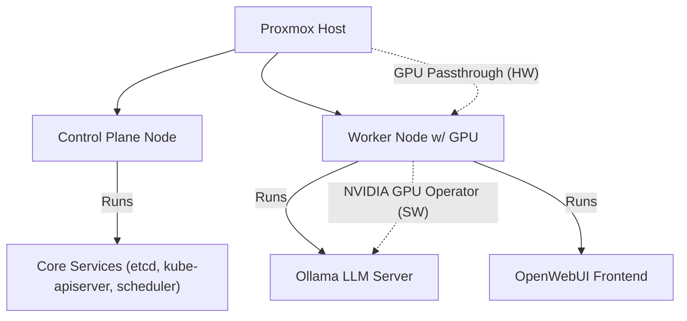

# 🏡 HomeLab Setup: K3s + Ollama + OpenWebUI on Proxmox

This project describes a lightweight, GPU-accelerated home lab deployment using [K3s](https://k3s.io/), [Ollama](https://ollama.com/), and [OpenWebUI](https://github.com/open-webui/open-webui). The system is optimized for for running local large language models (LLMs) with GPU passthrough on a Proxmox-hosted Kubernetes cluster.

---

## 📦 Hardware Overview

| Component       | Specification                              |
|----------------|----------------------------------------------|
| **CPU**         | Intel Xeon E5-2673 v4 (20 cores / 40 threads) |
| **Motherboard** | X99K (Socket 2011-3)                        |
| **RAM**         | 32GB DDR4 ECC (2×16GB)                     |
| **GPU**         | Nvidia EVGA P104-100 (8GB VRAM, unlocked)  |
| **Storage**     | 1TB Crucial P2 NVMe SSD                    |
| **NIC**         | USB Wi-Fi Adapter                          |

---

## 🖥️ Virtualization Environment

- **Hypervisor**: Proxmox VE
- **Virtualization Type**: KVM/QEMU
- **GPU Passthrough**: Enabled (via `vfio` + NVIDIA GPU Operator in K3s)
- **Networking**: NAT-based forwarding (USB Wi-Fi prevents bridged mode)

---

## 📈 Cluster Topology


```mermaid
graph TD;
    PVE[Proxmox Host] --> K3sMaster[Control Plane Node];
    PVE --> K3sWorker[Worker Node w/ GPU];
    PVE -.->|"GPU Passthrough (HW)"| K3sWorker;
    K3sMaster -->|Runs| Core["Core Services (etcd, kube-apiserver, scheduler)"];
    K3sWorker -->|Runs| Ollama[Ollama LLM Server];
    K3sWorker -->|Runs| OpenWebUI[OpenWebUI Frontend];
    K3sWorker -.->|"NVIDIA GPU Operator (SW)"| Ollama;
```

> Diagram: Simple two-node K3s cluster running Ollama and OpenWebUI on GPU-enabled worker.

---

## 🧠 LLM Stack

- **Ollama** – serves locally hosted LLMs (e.g. LLaMA, Mistral)
- **OpenWebUI** – provides a browser-based chat interface
- **NVIDIA GPU Operator** – used for automatic GPU provisioning in Kubernetes

## 🔧 Services Running

| Node           | Services                                 |
|----------------|------------------------------------------|
| Control Plane  | etcd, CoreDNS, kube-apiserver, scheduler |
| Worker Node    | Ollama, OpenWebUI, NVIDIA Operator       |

## 🚧 Known Limitations

- USB Wi-Fi restricts use of bridged networking (using NAT instead)
- GPU (**EVGA P104-100**) requires manual unlocking by flashing [this BIOS file](https://www.techpowerup.com/vgabios/228114/228114) using the `nvflash` utility to enable full access to all 8 GB of physical memory.
- P2 NVMe may throttle under sustained load

---

## 🌐 Networking: NAT and Port Forwarding

Due to hardware limitations, specifically the use of a **USB Wi-Fi adapter**, bridged networking is not supported on this Proxmox host. This constraint prevents me from assigning public IPs directly to VMs or containers. To work around this, the system uses **NAT-based forwarding** and `iptables` rules to provide:

- **Internet access** for K3s nodes.
- **External access** to select services inside the K3s cluster (e.g., OpenWebUI).

### 🔁 Why NAT?

NAT (Network Address Translation) is required because:

- The USB Wi-Fi interface cannot be bridged in Proxmox (no MAC spoofing support).
- All K3s nodes are on a private internal network (e.g., `192.168.100.0/24`).
- Public internet traffic must be routed through the host using masquerade rules.

### 🧱 Current iptables Configuration

Below are the current `iptables` rules used to enable NAT and port forwarding.

#### 🔄 Masquerade K3s Subnet for Internet Access

```bash
iptables -t nat -A POSTROUTING -s 192.168.100.0/24 -o wlxd03745f7912b -j MASQUERADE
```

#### 🌍 DNAT Rule: Expose OpenWebUI

This rule forwards incoming TCP traffic on port `8080` from the host to the K3s service on `192.168.100.3:32000` (NodePort exposed by OpenWebUI):

```bash
iptables -t nat -A PREROUTING -p tcp --dport 8080 -j DNAT --to-destination 192.168.100.3:32000
iptables -t nat -A POSTROUTING -p tcp -d 192.168.100.3 --dport 32000 -j MASQUERADE
```

### 🧪 Example: Accessing OpenWebUI

With the current setup, I can access the OpenWebUI chat interface by visiting:

```
http://<proxmox-ip>:8080
```

This forwards traffic to the NodePort inside the K3s worker node.

### 🛠️ Future Plans

- Replace USB Wi-Fi with a bridgable Ethernet interface or PCI Wi-Fi card to simplify networking.
- Move port forwarding logic to a managed firewall script or tool (e.g., `firewalld`, `ufw`, or Ansible role).
- Add HTTPS reverse proxy (e.g., Caddy or Nginx) to expose selected services securely.

---

## 🧮 Virtual Machines on Proxmox

| VM Name     | Purpose               | Notes |
|-------------|-----------------------|-------|
| `k3s-cp-1`  | K3s Control Plane     | Hosts core Kubernetes services: etcd, kube-apiserver, scheduler |
| `k3s-w-1`   | K3s Worker Node       | GPU-enabled node running Ollama, OpenWebUI, and other workloads |

### ⚙️ Planned CI/CD Services Deployment

| Service/Tool                      | Deployment Target      | Rationale |
|----------------------------------|------------------------|-----------|
| **GitLab CE**                    | 🆕 **Separate VM**      | GitLab is a resource-intensive service; isolating it improves reliability and avoids contention with K3s workloads. |
| **GitLab Runner**                | `k3s-w-1` (K3s)         | Easily deployed via Helm inside K3s; leverages Kubernetes scheduling and scaling. |
| **ArgoCD**                       | `k3s-cp-1` (K3s)        | Designed to run within Kubernetes; integrates tightly with GitOps workflows. |
| **GitLab Container Registry**    | Same as GitLab CE VM   | Runs alongside GitLab and depends on its filesystem and Docker registry integration. |
| **External Secrets / SOPS + KMS** | `k3s-cp-1` (K3s)       | Lightweight controller; clean integration into K3s for secret syncing from encrypted files. |

### 🆕 Planned New VM

| VM Name     | Purpose       | Recommended Specs              | Notes |
|-------------|---------------|-------------------------------|-------|
| `gitlab-ce` | GitLab Server | 4–8 vCPU, 8–16GB RAM, 100GB+ disk | Hosts GitLab CE and its container registry; backup-friendly and self-contained. |

## 💡 Planned CI/CD Stack for the Homelab

To simulate a production-like environment for DevOps experimentation and personal projects, the following CI/CD stack is planned:

| Category            | Tool/Service     | Purpose                                                                 |
|---------------------|------------------|-------------------------------------------------------------------------|
| **Git Hosting**     | GitLab CE        | Centralized Git repository management and integrated CI/CD platform     |
| **Runners**         | GitLab Runner    | Executes CI/CD pipelines on Kubernetes worker nodes                     |
| **K8s GitOps**      | ArgoCD           | Declarative GitOps delivery and continuous deployment for K8s workloads |
| **Container Registry** | GitLab Container Registry (self-hosted) | Stores Docker images securely within the GitLab CE environment          |
| **Secrets Management** | External Secrets / SOPS + KMS | Secure injection of secrets into Kubernetes from version-controlled encrypted files |
| **Webhook Gateway** | Gitea Webhook Proxy / GitLab Webhooks | Event-based triggers for pipelines and auto-deploy hooks                 |
| **Monitoring & Alerts** | Prometheus + Alertmanager | Observability stack for CI runners, ArgoCD status, and pod health        |
| **Dashboarding**    | Grafana          | Visualization of CI/CD and cluster health metrics                        |


## 📌 To Do

- [ ] Add Helm-based deployment instructions
- [ ] Benchmark LLM inference performance
- [ ] Set up automatic image version update.
- [ ] Add common best-practice CI/CD services (GitLab CE, ArgoCD, runner agents, container registry, webhooks, secrets management, etc.)

---

## 🔗 Deployment Reference Guides

Here are helpful guides I used when setting up this homelab. Each link points to a well-written and updated resource:

- [**K3s Setup Guide**](https://docs.k3s.io/installation/)
  Official K3s documentation on setting up K3s in various environments.

- [**Proxmox Wiki - PCI(e) Passthrough**](https://pve.proxmox.com/wiki/Pci_passthrough)
  Official Proxmox guide on configuring IOMMU, GRUB, and passthrough devices.

- [**NVIDIA Official GPU Operator Docs**](https://docs.nvidia.com/datacenter/cloud-native/gpu-operator/)
  Canonical resource for deploying the GPU Operator with Helm or manifests.

- [**GitHub - NVIDIA GPU Operator Repo**](https://github.com/NVIDIA/gpu-operator)
  Source code and deployment examples.

- [**OpenWebUI GitHub (K8s manifests available)**](https://github.com/open-webui/open-webui)
  Includes Docker and Kubernetes options, community-maintained.

- [**Ollama - Github**](https://github.com/ollama/ollama)
  Official instructions for CLI usage, model downloads, and local hosting.

