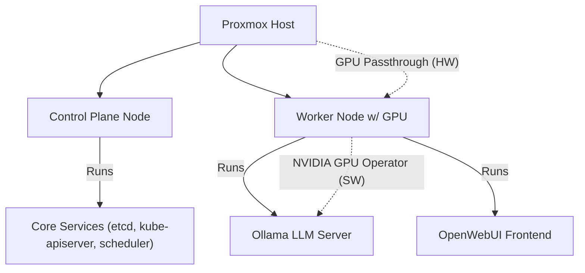

# 🖥️ Virtualization Environment

This homelab runs on a Proxmox VE hypervisor, leveraging KVM/QEMU for virtualization. Key features include:

- **Hypervisor:** Proxmox VE
- **Virtualization Type:** KVM/QEMU
- **GPU Passthrough:** Enabled via `vfio` and NVIDIA GPU Operator in K3s
- **Networking:**
  - **LAN (bridged):** For internal traffic and overlay networks
  - **NAT:** Via home router for outbound/internet traffic
  - **HTTPS exposure:** Through reverse proxy (Nginx)

**GPU Passthrough Note:**
- The EVGA P104-100 GPU requires manual unlocking by flashing a custom BIOS using `nvflash` to enable full access to all 8 GB of VRAM.

**Networking Evolution:**
- The lab previously used a USB Wi-Fi adapter (no bridged mode support), requiring NAT and custom iptables rules. Now, bridged Ethernet is used for direct IP assignment to VMs and Kubernetes services, simplifying service exposure and removing the need for NAT or manual port forwarding. 
